# Polyglot Codebase Knowledge Graph

> Generated offline by **readmenator**. Supports C, C++, Python, Go, Rust, JS/TS, Java, C#, Shell, PHP, Dart, GDScript, Nim, ASM.
> No LLMs. No tokens. Pure static analysis. See more [here](https://github.com/grisuno/ReadMenator)

**Total Files Parsed:** 3 | **Total Symbols Extracted:** 68 | **Total Imports:** 32

## Structural Knowledge Map

```mermaid
graph TD
    classDef mod fill:#1e1e1e,stroke:#ff6666,stroke-width:2px,color:#fff;
    classDef cls fill:#2d2d2d,stroke:#4ec9b0,stroke-width:2px,color:#fff;
    classDef fn fill:#333,stroke:#dcdcaa,stroke-width:1px,color:#dcdcaa;
    classDef ext fill:#111,stroke:#666,stroke-dasharray: 5 5,color:#aaa;
    trimario4_py["trimario4.py (py)"]
    class trimario4_py mod;
    trimario4_py__safe_text["_safe_text"]
    class trimario4_py__safe_text fn;
    trimario4_py --> trimario4_py__safe_text
    trimario4_py_TimeoutException["TimeoutException"]
    class trimario4_py_TimeoutException cls;
    trimario4_py --> trimario4_py_TimeoutException
    trimario4_py_timeout_handler["timeout_handler"]
    class trimario4_py_timeout_handler fn;
    trimario4_py --> trimario4_py_timeout_handler
    trimario4_py_safe_step_with_timeout["safe_step_with_timeout"]
    class trimario4_py_safe_step_with_timeout fn;
    trimario4_py --> trimario4_py_safe_step_with_timeout
    trimario4_py_Config["Config"]
    class trimario4_py_Config cls;
    trimario4_py --> trimario4_py_Config
    app_py["app.py (py)"]
    class app_py mod;
    app_py_compute_real_saliency["compute_real_saliency"]
    class app_py_compute_real_saliency fn;
    app_py --> app_py_compute_real_saliency
    app_py_run_and_log_activations["run_and_log_activations"]
    class app_py_run_and_log_activations fn;
    app_py --> app_py_run_and_log_activations
    app_py_plot_activation_3d_and_bars["plot_activation_3d_and_bars"]
    class app_py_plot_activation_3d_and_bars fn;
    app_py --> app_py_plot_activation_3d_and_bars
    app_py_visualize_attention_layers["visualize_attention_layers"]
    class app_py_visualize_attention_layers fn;
    app_py --> app_py_visualize_attention_layers
    install_sh["install.sh (sh)"]
    class install_sh mod;
    ext_warnings["warnings"]
    class ext_warnings ext;
    app_py -.->|imports| ext_warnings
    ext_torch["torch"]
    class ext_torch ext;
    app_py -.->|imports| ext_torch
    ext_numpy["numpy"]
    class ext_numpy ext;
    app_py -.->|imports| ext_numpy
    ext_matplotlib_pyplot["matplotlib.pyplot"]
    class ext_matplotlib_pyplot ext;
    app_py -.->|imports| ext_matplotlib_pyplot
    ext_tqdm["tqdm"]
    class ext_tqdm ext;
    app_py -.->|imports| ext_tqdm
    ext_cv2["cv2"]
    class ext_cv2 ext;
    app_py -.->|imports| ext_cv2
    ext_gym["gym"]
    class ext_gym ext;
    app_py -.->|imports| ext_gym
    ext_gym_super_mario_bros["gym_super_mario_bros"]
    class ext_gym_super_mario_bros ext;
    app_py -.->|imports| ext_gym_super_mario_bros
    ext_nes_py_wrappers["nes_py.wrappers"]
    class ext_nes_py_wrappers ext;
    app_py -.->|imports| ext_nes_py_wrappers
    ext_gym_super_mario_bros_actions["gym_super_mario_bros.actions"]
    class ext_gym_super_mario_bros_actions ext;
    app_py -.->|imports| ext_gym_super_mario_bros_actions
    ext_umap["umap"]
    class ext_umap ext;
    app_py -.->|imports| ext_umap
    ext_trimario4["trimario4"]
    class ext_trimario4 ext;
    app_py -.->|imports| ext_trimario4
    trimario4_py -.->|imports| ext_warnings
    trimario4_py -.->|imports| ext_torch
    ext_torch_nn["torch.nn"]
    class ext_torch_nn ext;
    trimario4_py -.->|imports| ext_torch_nn
    ext_torch_optim["torch.optim"]
    class ext_torch_optim ext;
    trimario4_py -.->|imports| ext_torch_optim
    ext_copy["copy"]
    class ext_copy ext;
    trimario4_py -.->|imports| ext_copy
    trimario4_py -.->|imports| ext_gym
    trimario4_py -.->|imports| ext_gym_super_mario_bros
    trimario4_py -.->|imports| ext_nes_py_wrappers
    trimario4_py -.->|imports| ext_gym_super_mario_bros_actions
    trimario4_py -.->|imports| ext_cv2
    trimario4_py -.->|imports| ext_numpy
    ext_random["random"]
    class ext_random ext;
    trimario4_py -.->|imports| ext_random
    ext_collections["collections"]
    class ext_collections ext;
    trimario4_py -.->|imports| ext_collections
    ext_pickle["pickle"]
    class ext_pickle ext;
    trimario4_py -.->|imports| ext_pickle
    ext_os["os"]
    class ext_os ext;
    trimario4_py -.->|imports| ext_os
    trimario4_py -.->|imports| ext_tqdm
    ext_matplotlib["matplotlib"]
    class ext_matplotlib ext;
    trimario4_py -.->|imports| ext_matplotlib
    trimario4_py -.->|imports| ext_matplotlib_pyplot
    ext_time["time"]
    class ext_time ext;
    trimario4_py -.->|imports| ext_time
    ext_signal["signal"]
    class ext_signal ext;
    trimario4_py -.->|imports| ext_signal
```

---

## Architecture Reference

### PY (2 files)

#### `app.py`
**Path:** `app.py`

**Functions:**
- `compute_real_saliency` (line 55) `def compute_real_saliency(agent, state, aux_features)`
- `run_and_log_activations` (line 130) `def run_and_log_activations(agent, env, num_steps)`
- `plot_activation_3d_and_bars` (line 215) `def plot_activation_3d_and_bars(log_data)`
- `visualize_attention_layers` (line 323) `def visualize_attention_layers(agent, state, aux_features)` - *Visualiza mapas de atención en diferentes etapas del procesamiento*

#### `trimario4.py`
**Path:** `trimario4.py`

**Classes:**
- `TimeoutException` (line 45) `class TimeoutException(Exception)`
- `Config` (line 68) `class Config`
- `AudioFeatureGenerator` (line 236) `class AudioFeatureGenerator`
- `FrameSkip` (line 441) `class FrameSkip`
- `StuckMonitor` (line 473) `class StuckMonitor`
- `VisualFeatureExtractor` (line 600) `class VisualFeatureExtractor`
- `StableLiquidNeuron` (line 686) `class StableLiquidNeuron`
- `RightHemisphere` (line 815) `class RightHemisphere`
- `CorpusCallosum` (line 924) `class CorpusCallosum`
- `PrioritizedReplayBuffer` (line 1142) `class PrioritizedReplayBuffer`
- `LeftHemisphere` (line 1206) `class LeftHemisphere`
- `EpisodicMemory` (line 1323) `class EpisodicMemory`
- `TricameralMarioAgent` (line 1450) `class TricameralMarioAgent`

**Functions:**
- `_safe_text` (line 34) `def _safe_text(self, x, y, s)`
- `timeout_handler` (line 48) `def timeout_handler(signum, frame)`
- `safe_step_with_timeout` (line 51) `def safe_step_with_timeout(env, action, timeout_seconds)` - *Ejecuta step con timeout para detectar bloqueos*
- `log_detailed_metrics` (line 181) `def log_detailed_metrics(agent, ep, scores, losses, accuracies)`
- `preprocess_frame` (line 552) `def preprocess_frame(frame)` - *Versión ultra-robusta: nunca devuelve NaN/inf.*
- `stack_frames` (line 580) `def stack_frames(stacked, frame, is_new)`
- `compute_focus_quality_score` (line 1797) `def compute_focus_quality_score(saliency_map)` - *Calcula score de calidad del foco visual*
- `get_aux_features` (line 1830) `def get_aux_features(info, history)`
- `__init__` (line 237) `def __init__(self, device)`
- `extract_event_features` (line 309) `def extract_event_features(self, info)`
- `forward` (line 365) `def forward(self, info, visual_context)`
- `reset` (line 429) `def reset(self)`
- `__init__` (line 442) `def __init__(self, env, skip)`
- `step` (line 446) `def step(self, action)`
- `__init__` (line 474) `def __init__(self, env, stuck_limit, inactivity_limit)`
- `reset_stats` (line 480) `def reset_stats(self)`
- `step` (line 490) `def step(self, action)`
- `reset` (line 529) `def reset(self)`
- `__init__` (line 601) `def __init__(self, device)`
- `forward` (line 658) `def forward(self, x)`
- `__init__` (line 687) `def __init__(self, in_dim, out_dim, device)`
- `forward` (line 715) `def forward(self, x)`
- `compute_plasticity_gradient` (line 755) `def compute_plasticity_gradient(self, x, output, td_error)`
- `post_step_update` (line 806) `def post_step_update(self)`
- `__init__` (line 816) `def __init__(self, input_dim, output_dim, aux_dim, device)`
- `forward` (line 841) `def forward(self, stacked_frame, aux_features, goal_x, current_x, info, visualization_mode)`
- `forward_legacy` (line 913) `def forward_legacy(self, stacked_frame, aux_features, goal_x, current_x)` - *Wrapper para compatibilidad con código que espera 5 retornos*
- `__init__` (line 925) `def __init__(self, dim)`
- `forward` (line 961) `def forward(self, visual_features, audio_features, semantic_features, td_error)`
- `reset_fatigue` (line 1136) `def reset_fatigue(self)`
- `__init__` (line 1143) `def __init__(self, capacity)`
- `__len__` (line 1149) `def __len__(self)`
- `add` (line 1152) `def add(self, experience, td_error)`
- `sample` (line 1163) `def sample(self, batch_size, beta)`
- `update_priorities` (line 1200) `def update_priorities(self, indices, td_errors)`
- `__init__` (line 1207) `def __init__(self, n_actions, input_dim, hidden_dim)`
- `forward` (line 1248) `def forward(self, x)`
- `forward_with_cache` (line 1271) `def forward_with_cache(self, x)`
- `reset_memory` (line 1291) `def reset_memory(self)` - *Reinicia el buffer de memoria episódica del hemisferio izquierdo*
- `store_experience` (line 1300) `def store_experience(self, x)` - *Almacena una experiencia en el buffer circular*
- `__init__` (line 1324) `def __init__(self, device)`
- `store_episode` (line 1355) `def store_episode(self, event_type, liquid_state)`
- `retrieve_similar_episode` (line 1400) `def retrieve_similar_episode(self, current_state)`
- `__init__` (line 1451) `def __init__(self, n_actions, device)`
- `act` (line 1511) `def act(self, state, aux_features, epsilon, info)`
- `remember` (line 1542) `def remember(self, s, a, r, s_next, aux_s, aux_s_next, done, td_error)`
- `update_target_networks` (line 1554) `def update_target_networks(self, tau)`
- `replay` (line 1566) `def replay(self, batch_size, gamma)`
- `propose_goal` (line 1746) `def propose_goal(self, current_x, episode_num)`
- `is_goal_achieved` (line 1770) `def is_goal_achieved(self, goal_x, current_x)`
- `reset` (line 1773) `def reset(self)`

### SH (1 files)

#### `install.sh`
**Path:** `install.sh`

*No symbols extracted*
