# Polyglot Codebase Knowledge Graph

> Generated offline by **readmenator**. Supports C, C++, Python, Go, Rust, JS/TS, Java, C#, Shell, PHP, Dart, GDScript, Nim, ASM, Ruby, Swift, Kotlin, Scala, Lua, Elixir.
> No LLMs. No tokens. Pure static analysis. See more [here](https://github.com/grisuno/ReadMenator)

**Total Files Parsed:** 3 | **Total Symbols Extracted:** 68 | **Total Imports:** 32
 | **Resolved Imports:** 1

<!-- ranking_model: v1.0 | weights: {ppr:0.45,auth:0.2,test:0.15,doc:0.1,fresh:0.1} | alpha:0.85 | commit:4c8e0d2 | date:2026-07-18 -->


## Table of Contents

1. [Statistics Dashboard](#statistics-dashboard)
2. [Architectural Layers](#architectural-layers)
3. [Ranked Context](#ranked-context)
4. [God Nodes](#god-nodes)
5. [Community Analysis](#community-analysis)
6. [Suggested Questions](#suggested-questions)
7. [Hotspot Analysis](#hotspot-analysis)
8. [Change Impact Analysis](#change-impact-analysis)
9. [Suggested Linting Rules](#suggested-linting-rules)
10. [Orphans](#orphans)
11. [Query Recipes](#query-recipes)
12. [Structural Knowledge Map](#structural-knowledge-map)
13. [UML Class Diagram](#uml-class-diagram)
14. [Code Property Graph](#code-property-graph)
15. [Architecture Reference](#architecture-reference)
    - [PY (2 files)](#py-2-files)
    - [SH (1 files)](#sh-1-files)

---

## Statistics Dashboard

| Metric | Value |
|--------|-------|
| Total Files | 3 |
| Total Symbols | 68 |
| Total Imports | 32 |
| Call Edges | 1172 |
| Inheritance Edges | 11 |
| Languages | 2 |
| Avg Symbols/File | 22.7 |
| Avg Imports/File | 10.7 |
| Resolved Imports | 1 |

### Top Files by Import Count (Fan-Out)

| File | Imports | Symbols | Language |
|------|---------|---------|----------|
| `trimario4.py` | 20 | 64 | py |
| `app.py` | 12 | 4 | py |

---

## Architectural Layers

Auto-detected from path patterns, naming conventions, and imported frameworks.

| Layer | Files |
|-------|-------|
| utility | 3 |

### utility

- `app.py` (py, 4 symbols)
- `install.sh` (sh, 0 symbols)
- `trimario4.py` (py, 64 symbols)

---

## Ranked Context

Files ranked by composite score for the current query context. The ranking combines Personalized PageRank (query relevance), global authority, test coverage, documentation coverage, and code freshness. Model: v1.0.

| Rank | File | Composite | PPR | Authority | Test | Doc |
|------|------|-----------|-----|-----------|------|-----|
| 1 | `trimario4.py` | 0.4313 | 0.6491 | 0.6491 | 0.00 | 0.09 |
| 2 | `app.py` | 0.2781 | 0.3509 | 0.3509 | 0.00 | 0.50 |
| 3 | `install.sh` | 0.0000 | 0.0000 | 0.0000 | 0.00 | 0.00 |

---

## God Nodes

Most architecturally central files ranked by combined import/export degree and symbol richness.

| File | Score | Connections | PageRank |
|------|-------|-------------|----------|
| `trimario4.py` | 8.4 | | 0.6491 |
| `app.py` | 2.4 | | 0.3509 |
| `install.sh` | 0.0 | | 0.0000 |

---

## Community Analysis

Files grouped by import-based community detection. Cohesion measures how tightly connected each community is internally.

### root (Cohesion: 1.00)

**2 files** in this community:

- `app.py` (py, 4 symbols)
- `trimario4.py` (py, 64 symbols)

---

## Suggested Questions

Auto-generated exploration prompts based on graph structure:

- What does trimario4.py depend on, and what depends on it? (1 connections)
- What does app.py depend on, and what depends on it? (1 connections)
- What does install.sh depend on, and what depends on it? (0 connections)
- What is TimeoutException in trimario4.py and how is it used?
- What is the overall architecture of this codebase?

---

## Hotspot Analysis

Files ranked by combined complexity (symbol count) and centrality (connection count). High-scoring files are architecturally critical and may need refactoring attention.

| File | Complexity | Centrality | Combined | Symbols | Connections |
|------|-----------|------------|----------|---------|-------------|
| `trimario4.py` | 1.000 | 1.000 | 1.000 | 64 | 21 |
| `app.py` | 0.062 | 0.619 | 0.396 | 4 | 13 |
| `install.sh` | 0.000 | 0.000 | 0.000 | 0 | 0 |

---

## Change Impact Analysis

Files sorted by how many other files would be affected if they changed. High-impact files should be changed with caution.

| File | Direct Dependents | Transitive Dependents | Total Impact |
|------|------------------|----------------------|--------------|
| `trimario4.py` | 1 | 0 | 1 |
| `app.py` | 0 | 0 | 0 |
| `install.sh` | 0 | 0 | 0 |

---

## Suggested Linting Rules

Automatically suggested linting and security rules based on patterns detected in the codebase. These can be exported as Semgrep rules using the `--export-rules` flag.

| Rule ID | Severity | Description | Language | Matches |
|---------|----------|-------------|----------|---------|
| `RM001` | info | Large number of functions in py: 55 total | py | 55 |
| `RM002` | info | Print statement found (consider logging instead) | python | 73 |

---

## Orphans

Files with no documentation or low connectivity. These are candidates for documentation investment or cleanup.

- `install.sh` (0 symbols, no doc)

---

## Query Recipes

Example queries you can run against this knowledge base using the ranking engine:

```
# Find files most relevant to a concept
readmenator query "Where is the import resolver implemented?"

# Rank files by relevance to a topic
readmenator query "How does documentation generation work?"

# Explain why a file ranks highly
readmenator query "explain readmenator/_documentation.py"

# Trace dependency paths with ranked context
readmenator query "path from CLI to exporter"
```

The ranking model uses the following signals:

- **Personalized PageRank** (45% weight): query-specific relevance via seed propagation
- **Global Authority** (20% weight): structural importance via standard PageRank
- **Test Coverage** (15% weight): fraction of symbols referenced in test files
- **Doc Coverage** (10% weight): presence of docstrings and file-level docs
- **Freshness** (10% weight): recent modification activity

Results include score decomposition and justification paths for each ranked item.

---

## Structural Knowledge Map

```mermaid
graph TD
    classDef mod fill:#1e1e1e,stroke:#ff6666,stroke-width:2px,color:#fff;
    classDef cls fill:#2d2d2d,stroke:#4ec9b0,stroke-width:2px,color:#fff;
    classDef fn fill:#333,stroke:#dcdcaa,stroke-width:1px,color:#dcdcaa;
    classDef ext fill:#111,stroke:#666,stroke-dasharray:5 5,color:#aaa;
    subgraph community_0 ["root"]
    trimario4_py["trimario4.py (py)"]
    class trimario4_py mod;
    trimario4_py__safe_text["_safe_text"]
    class trimario4_py__safe_text fn;
    trimario4_py --> trimario4_py__safe_text
    trimario4_py_TimeoutException["TimeoutException"]
    class trimario4_py_TimeoutException cls;
    trimario4_py --> trimario4_py_TimeoutException
    trimario4_py_timeout_handler["timeout_handler"]
    class trimario4_py_timeout_handler fn;
    trimario4_py --> trimario4_py_timeout_handler
    trimario4_py_safe_step_with_timeout["safe_step_with_timeout"]
    class trimario4_py_safe_step_with_timeout fn;
    trimario4_py --> trimario4_py_safe_step_with_timeout
    trimario4_py_Config["Config"]
    class trimario4_py_Config cls;
    trimario4_py --> trimario4_py_Config
    app_py["app.py (py)"]
    class app_py mod;
    install_sh["install.sh (sh)"]
    class install_sh mod;
    end
    app_py -- resolved_imports --> trimario4_py
    ext_warnings["warnings"]
    class ext_warnings ext;
    app_py -.->|imports| ext_warnings
    ext_torch["torch"]
    class ext_torch ext;
    app_py -.->|imports| ext_torch
    ext_numpy["numpy"]
    class ext_numpy ext;
    app_py -.->|imports| ext_numpy
    ext_matplotlib_pyplot["matplotlib.pyplot"]
    class ext_matplotlib_pyplot ext;
    app_py -.->|imports| ext_matplotlib_pyplot
    ext_tqdm["tqdm"]
    class ext_tqdm ext;
    app_py -.->|imports| ext_tqdm
    ext_cv2["cv2"]
    class ext_cv2 ext;
    app_py -.->|imports| ext_cv2
    ext_gym["gym"]
    class ext_gym ext;
    app_py -.->|imports| ext_gym
    ext_gym_super_mario_bros["gym_super_mario_bros"]
    class ext_gym_super_mario_bros ext;
    app_py -.->|imports| ext_gym_super_mario_bros
    ext_nes_py_wrappers["nes_py.wrappers"]
    class ext_nes_py_wrappers ext;
    app_py -.->|imports| ext_nes_py_wrappers
    ext_gym_super_mario_bros_actions["gym_super_mario_bros.actions"]
    class ext_gym_super_mario_bros_actions ext;
    app_py -.->|imports| ext_gym_super_mario_bros_actions
    ext_umap["umap"]
    class ext_umap ext;
    app_py -.->|imports| ext_umap
    ext_trimario4["trimario4"]
    class ext_trimario4 ext;
    app_py -.->|imports| ext_trimario4
    trimario4_py -.->|imports| ext_warnings
    trimario4_py -.->|imports| ext_torch
    ext_torch_nn["torch.nn"]
    class ext_torch_nn ext;
    trimario4_py -.->|imports| ext_torch_nn
    ext_torch_optim["torch.optim"]
    class ext_torch_optim ext;
    trimario4_py -.->|imports| ext_torch_optim
    ext_copy["copy"]
    class ext_copy ext;
    trimario4_py -.->|imports| ext_copy
    trimario4_py -.->|imports| ext_gym
    trimario4_py -.->|imports| ext_gym_super_mario_bros
    trimario4_py -.->|imports| ext_nes_py_wrappers
    trimario4_py -.->|imports| ext_gym_super_mario_bros_actions
    trimario4_py -.->|imports| ext_cv2
    trimario4_py -.->|imports| ext_numpy
    ext_random["random"]
    class ext_random ext;
    trimario4_py -.->|imports| ext_random
    ext_collections["collections"]
    class ext_collections ext;
    trimario4_py -.->|imports| ext_collections
    ext_pickle["pickle"]
    class ext_pickle ext;
    trimario4_py -.->|imports| ext_pickle
    ext_os["os"]
    class ext_os ext;
    trimario4_py -.->|imports| ext_os
    trimario4_py -.->|imports| ext_tqdm
    ext_matplotlib["matplotlib"]
    class ext_matplotlib ext;
    trimario4_py -.->|imports| ext_matplotlib
    trimario4_py -.->|imports| ext_matplotlib_pyplot
    ext_time["time"]
    class ext_time ext;
    trimario4_py -.->|imports| ext_time
    ext_signal["signal"]
    class ext_signal ext;
    trimario4_py -.->|imports| ext_signal
```



---

## UML Class Diagram

Auto-generated Mermaid class diagram from parsed class-level symbols. Shows classes, structs, interfaces, traits, and their methods with inheritance and dependency relationships.

```mermaid
classDiagram
  class trimario4_py_TimeoutException {
    <<class>>
    +_safe_text(self, x, y, s)
    +timeout_handler(signum, frame)
    +safe_step_with_timeout(env, action, timeout_seconds)
    +log_detailed_metrics(agent, ep, scores, losses, accuracies)
    +preprocess_frame(frame)
    +stack_frames(stacked, frame, is_new)
    +compute_focus_quality_score(saliency_map)
    +get_aux_features(info, history)
    +__init__(self, device)
    +extract_event_features(self, info)
  }
  class trimario4_py_Config {
    <<class>>
    +_safe_text(self, x, y, s)
    +timeout_handler(signum, frame)
    +safe_step_with_timeout(env, action, timeout_seconds)
    +log_detailed_metrics(agent, ep, scores, losses, accuracies)
    +preprocess_frame(frame)
    +stack_frames(stacked, frame, is_new)
    +compute_focus_quality_score(saliency_map)
    +get_aux_features(info, history)
    +__init__(self, device)
    +extract_event_features(self, info)
  }
  class trimario4_py_AudioFeatureGenerator {
    <<class>>
    +_safe_text(self, x, y, s)
    +timeout_handler(signum, frame)
    +safe_step_with_timeout(env, action, timeout_seconds)
    +log_detailed_metrics(agent, ep, scores, losses, accuracies)
    +preprocess_frame(frame)
    +stack_frames(stacked, frame, is_new)
    +compute_focus_quality_score(saliency_map)
    +get_aux_features(info, history)
    +__init__(self, device)
    +extract_event_features(self, info)
  }
  class trimario4_py_FrameSkip {
    <<class>>
    +_safe_text(self, x, y, s)
    +timeout_handler(signum, frame)
    +safe_step_with_timeout(env, action, timeout_seconds)
    +log_detailed_metrics(agent, ep, scores, losses, accuracies)
    +preprocess_frame(frame)
    +stack_frames(stacked, frame, is_new)
    +compute_focus_quality_score(saliency_map)
    +get_aux_features(info, history)
    +__init__(self, device)
    +extract_event_features(self, info)
  }
  class trimario4_py_StuckMonitor {
    <<class>>
    +_safe_text(self, x, y, s)
    +timeout_handler(signum, frame)
    +safe_step_with_timeout(env, action, timeout_seconds)
    +log_detailed_metrics(agent, ep, scores, losses, accuracies)
    +preprocess_frame(frame)
    +stack_frames(stacked, frame, is_new)
    +compute_focus_quality_score(saliency_map)
    +get_aux_features(info, history)
    +__init__(self, device)
    +extract_event_features(self, info)
  }
  class trimario4_py_VisualFeatureExtractor {
    <<class>>
    +_safe_text(self, x, y, s)
    +timeout_handler(signum, frame)
    +safe_step_with_timeout(env, action, timeout_seconds)
    +log_detailed_metrics(agent, ep, scores, losses, accuracies)
    +preprocess_frame(frame)
    +stack_frames(stacked, frame, is_new)
    +compute_focus_quality_score(saliency_map)
    +get_aux_features(info, history)
    +__init__(self, device)
    +extract_event_features(self, info)
  }
  class trimario4_py_StableLiquidNeuron {
    <<class>>
    +_safe_text(self, x, y, s)
    +timeout_handler(signum, frame)
    +safe_step_with_timeout(env, action, timeout_seconds)
    +log_detailed_metrics(agent, ep, scores, losses, accuracies)
    +preprocess_frame(frame)
    +stack_frames(stacked, frame, is_new)
    +compute_focus_quality_score(saliency_map)
    +get_aux_features(info, history)
    +__init__(self, device)
    +extract_event_features(self, info)
  }
  class trimario4_py_RightHemisphere {
    <<class>>
    +_safe_text(self, x, y, s)
    +timeout_handler(signum, frame)
    +safe_step_with_timeout(env, action, timeout_seconds)
    +log_detailed_metrics(agent, ep, scores, losses, accuracies)
    +preprocess_frame(frame)
    +stack_frames(stacked, frame, is_new)
    +compute_focus_quality_score(saliency_map)
    +get_aux_features(info, history)
    +__init__(self, device)
    +extract_event_features(self, info)
  }
  class trimario4_py_CorpusCallosum {
    <<class>>
    +_safe_text(self, x, y, s)
    +timeout_handler(signum, frame)
    +safe_step_with_timeout(env, action, timeout_seconds)
    +log_detailed_metrics(agent, ep, scores, losses, accuracies)
    +preprocess_frame(frame)
    +stack_frames(stacked, frame, is_new)
    +compute_focus_quality_score(saliency_map)
    +get_aux_features(info, history)
    +__init__(self, device)
    +extract_event_features(self, info)
  }
  class trimario4_py_PrioritizedReplayBuffer {
    <<class>>
    +_safe_text(self, x, y, s)
    +timeout_handler(signum, frame)
    +safe_step_with_timeout(env, action, timeout_seconds)
    +log_detailed_metrics(agent, ep, scores, losses, accuracies)
    +preprocess_frame(frame)
    +stack_frames(stacked, frame, is_new)
    +compute_focus_quality_score(saliency_map)
    +get_aux_features(info, history)
    +__init__(self, device)
    +extract_event_features(self, info)
  }
  class trimario4_py_LeftHemisphere {
    <<class>>
    +_safe_text(self, x, y, s)
    +timeout_handler(signum, frame)
    +safe_step_with_timeout(env, action, timeout_seconds)
    +log_detailed_metrics(agent, ep, scores, losses, accuracies)
    +preprocess_frame(frame)
    +stack_frames(stacked, frame, is_new)
    +compute_focus_quality_score(saliency_map)
    +get_aux_features(info, history)
    +__init__(self, device)
    +extract_event_features(self, info)
  }
  class trimario4_py_EpisodicMemory {
    <<class>>
    +_safe_text(self, x, y, s)
    +timeout_handler(signum, frame)
    +safe_step_with_timeout(env, action, timeout_seconds)
    +log_detailed_metrics(agent, ep, scores, losses, accuracies)
    +preprocess_frame(frame)
    +stack_frames(stacked, frame, is_new)
    +compute_focus_quality_score(saliency_map)
    +get_aux_features(info, history)
    +__init__(self, device)
    +extract_event_features(self, info)
  }
  class trimario4_py_TricameralMarioAgent {
    <<class>>
    +_safe_text(self, x, y, s)
    +timeout_handler(signum, frame)
    +safe_step_with_timeout(env, action, timeout_seconds)
    +log_detailed_metrics(agent, ep, scores, losses, accuracies)
    +preprocess_frame(frame)
    +stack_frames(stacked, frame, is_new)
    +compute_focus_quality_score(saliency_map)
    +get_aux_features(info, history)
    +__init__(self, device)
    +extract_event_features(self, info)
  }
```



---

## Code Property Graph

Machine-readable Code Property Graph (CPG) in JSON-LD format. This block allows AI agents to parse the full structural graph without additional file reads. Compatible with GraphRAG pipelines.

```json
{"@context": "https://schema.org", "analysis": {"communities": [{"cohesion": 1.0, "id": 0, "label": "root", "size": 2}], "god_nodes": [{"node_id": "trimario4.py", "score": 8.4}, {"node_id": "app.py", "score": 2.4}, {"node_id": "install.sh", "score": 0.0}], "surprising_connections": []}, "edges": [{"confidence": "EXTRACTED", "relation": "imports", "source": "app.py", "target": "warnings"}, {"confidence": "EXTRACTED", "relation": "imports", "source": "app.py", "target": "torch"}, {"confidence": "EXTRACTED", "relation": "imports", "source": "app.py", "target": "numpy"}, {"confidence": "EXTRACTED", "relation": "imports", "source": "app.py", "target": "matplotlib.pyplot"}, {"confidence": "EXTRACTED", "relation": "imports", "source": "app.py", "target": "tqdm"}, {"confidence": "EXTRACTED", "relation": "imports", "source": "app.py", "target": "cv2"}, {"confidence": "EXTRACTED", "relation": "imports", "source": "app.py", "target": "gym"}, {"confidence": "EXTRACTED", "relation": "imports", "source": "app.py", "target": "gym_super_mario_bros"}, {"confidence": "EXTRACTED", "relation": "imports", "source": "app.py", "target": "nes_py.wrappers"}, {"confidence": "EXTRACTED", "relation": "imports", "source": "app.py", "target": "gym_super_mario_bros.actions"}, {"confidence": "EXTRACTED", "relation": "imports", "source": "app.py", "target": "umap"}, {"confidence": "EXTRACTED", "relation": "imports", "source": "app.py", "target": "trimario4"}, {"confidence": "EXTRACTED", "relation": "imports", "source": "trimario4.py", "target": "warnings"}, {"confidence": "EXTRACTED", "relation": "imports", "source": "trimario4.py", "target": "torch"}, {"confidence": "EXTRACTED", "relation": "imports", "source": "trimario4.py", "target": "torch.nn"}, {"confidence": "EXTRACTED", "relation": "imports", "source": "trimario4.py", "target": "torch.optim"}, {"confidence": "EXTRACTED", "relation": "imports", "source": "trimario4.py", "target": "copy"}, {"confidence": "EXTRACTED", "relation": "imports", "source": "trimario4.py", "target": "gym"}, {"confidence": "EXTRACTED", "relation": "imports", "source": "trimario4.py", "target": "gym_super_mario_bros"}, {"confidence": "EXTRACTED", "relation": "imports", "source": "trimario4.py", "target": "nes_py.wrappers"}, {"confidence": "EXTRACTED", "relation": "imports", "source": "trimario4.py", "target": "gym_super_mario_bros.actions"}, {"confidence": "EXTRACTED", "relation": "imports", "source": "trimario4.py", "target": "cv2"}, {"confidence": "EXTRACTED", "relation": "imports", "source": "trimario4.py", "target": "numpy"}, {"confidence": "EXTRACTED", "relation": "imports", "source": "trimario4.py", "target": "random"}, {"confidence": "EXTRACTED", "relation": "imports", "source": "trimario4.py", "target": "collections"}, {"confidence": "EXTRACTED", "relation": "imports", "source": "trimario4.py", "target": "pickle"}, {"confidence": "EXTRACTED", "relation": "imports", "source": "trimario4.py", "target": "os"}, {"confidence": "EXTRACTED", "relation": "imports", "source": "trimario4.py", "target": "tqdm"}, {"confidence": "EXTRACTED", "relation": "imports", "source": "trimario4.py", "target": "matplotlib"}, {"confidence": "EXTRACTED", "relation": "imports", "source": "trimario4.py", "target": "matplotlib.pyplot"}, {"confidence": "EXTRACTED", "relation": "imports", "source": "trimario4.py", "target": "time"}, {"confidence": "EXTRACTED", "relation": "imports", "source": "trimario4.py", "target": "signal"}, {"confidence": "EXTRACTED", "relation": "resolved_imports", "source": "app.py", "target": "trimario4.py"}], "generator": "readmenator", "metadata": {"edge_count": 1216, "file_count": 3, "language_count": 2, "symbol_count": 68}, "nodes": [{"doc": "_*_ coding: utf8 _*_", "id": "app.py", "kind": "module", "label": "app.py", "language": "py", "sha256": "6bfb5102eb8aa297", "symbol_count": 4, "symbols": [{"kind": "function", "line": 55, "name": "compute_real_saliency", "signature": "def compute_real_saliency(agent, state, aux_features)"}, {"kind": "function", "line": 130, "name": "run_and_log_activations", "signature": "def run_and_log_activations(agent, env, num_steps)"}, {"kind": "function", "line": 215, "name": "plot_activation_3d_and_bars", "signature": "def plot_activation_3d_and_bars(log_data)"}, {"doc": "Visualiza mapas de atención en diferentes etapas del procesamiento", "kind": "function", "line": 323, "name": "visualize_attention_layers", "signature": "def visualize_attention_layers(agent, state, aux_features)"}]}, {"id": "install.sh", "kind": "module", "label": "install.sh", "language": "sh", "sha256": "c907d80fd6734993", "symbol_count": 0, "symbols": []}, {"id": "trimario4.py", "kind": "module", "label": "trimario4.py", "language": "py", "sha256": "3393f513212c9df9", "symbol_count": 64, "symbols": [{"kind": "function", "line": 34, "name": "_safe_text", "signature": "def _safe_text(self, x, y, s)"}, {"kind": "class", "line": 45, "name": "TimeoutException", "signature": "class TimeoutException(Exception)"}, {"kind": "method", "line": 48, "name": "timeout_handler", "signature": "def timeout_handler(signum, frame)"}, {"doc": "Ejecuta step con timeout para detectar bloqueos", "kind": "method", "line": 51, "name": "safe_step_with_timeout", "signature": "def safe_step_with_timeout(env, action, timeout_seconds)"}, {"kind": "class", "line": 68, "name": "Config", "signature": "class Config"}, {"kind": "method", "line": 181, "name": "log_detailed_metrics", "signature": "def log_detailed_metrics(agent, ep, scores, losses, accuracies)"}, {"kind": "class", "line": 236, "name": "AudioFeatureGenerator", "signature": "class AudioFeatureGenerator(Module)"}, {"kind": "class", "line": 441, "name": "FrameSkip", "signature": "class FrameSkip(Wrapper)"}, {"kind": "class", "line": 473, "name": "StuckMonitor", "signature": "class StuckMonitor(Wrapper)"}, {"doc": "Versión ultra-robusta: nunca devuelve NaN/inf.", "kind": "method", "line": 552, "name": "preprocess_frame", "signature": "def preprocess_frame(frame)"}, {"kind": "method", "line": 580, "name": "stack_frames", "signature": "def stack_frames(stacked, frame, is_new)"}, {"kind": "class", "line": 600, "name": "VisualFeatureExtractor", "signature": "class VisualFeatureExtractor(Module)"}, {"kind": "class", "line": 686, "name": "StableLiquidNeuron", "signature": "class StableLiquidNeuron(Module)"}, {"kind": "class", "line": 815, "name": "RightHemisphere", "signature": "class RightHemisphere(Module)"}, {"kind": "class", "line": 924, "name": "CorpusCallosum", "signature": "class CorpusCallosum(Module)"}, {"kind": "class", "line": 1142, "name": "PrioritizedReplayBuffer", "signature": "class PrioritizedReplayBuffer"}, {"kind": "class", "line": 1206, "name": "LeftHemisphere", "signature": "class LeftHemisphere(Module)"}, {"kind": "class", "line": 1323, "name": "EpisodicMemory", "signature": "class EpisodicMemory(Module)"}, {"kind": "class", "line": 1450, "name": "TricameralMarioAgent", "signature": "class TricameralMarioAgent(Module)"}, {"doc": "Calcula score de calidad del foco visual", "kind": "method", "line": 1797, "name": "compute_focus_quality_score", "signature": "def compute_focus_quality_score(saliency_map)"}, {"kind": "method", "line": 1830, "name": "get_aux_features", "signature": "def get_aux_features(info, history)"}, {"kind": "method", "line": 237, "name": "__init__", "signature": "def __init__(self, device)"}, {"kind": "method", "line": 309, "name": "extract_event_features", "signature": "def extract_event_features(self, info)"}, {"kind": "method", "line": 365, "name": "forward", "signature": "def forward(self, info, visual_context)"}, {"kind": "method", "line": 429, "name": "reset", "signature": "def reset(self)"}, {"kind": "method", "line": 442, "name": "__init__", "signature": "def __init__(self, env, skip)"}, {"kind": "method", "line": 446, "name": "step", "signature": "def step(self, action)"}, {"kind": "method", "line": 474, "name": "__init__", "signature": "def __init__(self, env, stuck_limit, inactivity_limit)"}, {"kind": "method", "line": 480, "name": "reset_stats", "signature": "def reset_stats(self)"}, {"kind": "method", "line": 490, "name": "step", "signature": "def step(self, action)"}, {"kind": "method", "line": 529, "name": "reset", "signature": "def reset(self)"}, {"kind": "method", "line": 601, "name": "__init__", "signature": "def __init__(self, device)"}, {"kind": "method", "line": 658, "name": "forward", "signature": "def forward(self, x)"}, {"kind": "method", "line": 687, "name": "__init__", "signature": "def __init__(self, in_dim, out_dim, device)"}, {"kind": "method", "line": 715, "name": "forward", "signature": "def forward(self, x)"}, {"kind": "method", "line": 755, "name": "compute_plasticity_gradient", "signature": "def compute_plasticity_gradient(self, x, output, td_error)"}, {"kind": "method", "line": 806, "name": "post_step_update", "signature": "def post_step_update(self)"}, {"kind": "method", "line": 816, "name": "__init__", "signature": "def __init__(self, input_dim, output_dim, aux_dim, device)"}, {"kind": "method", "line": 841, "name": "forward", "signature": "def forward(self, stacked_frame, aux_features, goal_x, current_x, info, visualization_mode)"}, {"doc": "Wrapper para compatibilidad con código que espera 5 retornos", "kind": "method", "line": 913, "name": "forward_legacy", "signature": "def forward_legacy(self, stacked_frame, aux_features, goal_x, current_x)"}, {"kind": "method", "line": 925, "name": "__init__", "signature": "def __init__(self, dim)"}, {"kind": "method", "line": 961, "name": "forward", "signature": "def forward(self, visual_features, audio_features, semantic_features, td_error)"}, {"kind": "method", "line": 1136, "name": "reset_fatigue", "signature": "def reset_fatigue(self)"}, {"kind": "method", "line": 1143, "name": "__init__", "signature": "def __init__(self, capacity)"}, {"kind": "method", "line": 1149, "name": "__len__", "signature": "def __len__(self)"}, {"kind": "method", "line": 1152, "name": "add", "signature": "def add(self, experience, td_error)"}, {"kind": "method", "line": 1163, "name": "sample", "signature": "def sample(self, batch_size, beta)"}, {"kind": "method", "line": 1200, "name": "update_priorities", "signature": "def update_priorities(self, indices, td_errors)"}, {"kind": "method", "line": 1207, "name": "__init__", "signature": "def __init__(self, n_actions, input_dim, hidden_dim)"}, {"kind": "method", "line": 1248, "name": "forward", "signature": "def forward(self, x)"}, {"kind": "method", "line": 1271, "name": "forward_with_cache", "signature": "def forward_with_cache(self, x)"}, {"doc": "Reinicia el buffer de memoria episódica del hemisferio izquierdo", "kind": "method", "line": 1291, "name": "reset_memory", "signature": "def reset_memory(self)"}, {"doc": "Almacena una experiencia en el buffer circular", "kind": "method", "line": 1300, "name": "store_experience", "signature": "def store_experience(self, x)"}, {"kind": "method", "line": 1324, "name": "__init__", "signature": "def __init__(self, device)"}, {"kind": "method", "line": 1355, "name": "store_episode", "signature": "def store_episode(self, event_type, liquid_state)"}, {"kind": "method", "line": 1400, "name": "retrieve_similar_episode", "signature": "def retrieve_similar_episode(self, current_state)"}, {"kind": "method", "line": 1451, "name": "__init__", "signature": "def __init__(self, n_actions, device)"}, {"kind": "method", "line": 1511, "name": "act", "signature": "def act(self, state, aux_features, epsilon, info)"}, {"kind": "method", "line": 1542, "name": "remember", "signature": "def remember(self, s, a, r, s_next, aux_s, aux_s_next, done, td_error)"}, {"kind": "method", "line": 1554, "name": "update_target_networks", "signature": "def update_target_networks(self, tau)"}, {"kind": "method", "line": 1566, "name": "replay", "signature": "def replay(self, batch_size, gamma)"}, {"kind": "method", "line": 1746, "name": "propose_goal", "signature": "def propose_goal(self, current_x, episode_num)"}, {"kind": "method", "line": 1770, "name": "is_goal_achieved", "signature": "def is_goal_achieved(self, goal_x, current_x)"}, {"kind": "method", "line": 1773, "name": "reset", "signature": "def reset(self)"}]}], "type": "CodePropertyGraph", "version": "1.0"}
```

---

## Architecture Reference

### PY (2 files)

#### `app.py`
**Path:** `app.py`
**File Doc:** *_*_ coding: utf8 _*_*

**Functions:**
- `compute_real_saliency` (line 55) `def compute_real_saliency(agent, state, aux_features)`
- `run_and_log_activations` (line 130) `def run_and_log_activations(agent, env, num_steps)`
- `plot_activation_3d_and_bars` (line 215) `def plot_activation_3d_and_bars(log_data)`
- `visualize_attention_layers` (line 323) `def visualize_attention_layers(agent, state, aux_features)` - *Visualiza mapas de atención en diferentes etapas del procesamiento*

#### `trimario4.py`
**Path:** `trimario4.py`

**Classes:**
- `TimeoutException` (line 45) `class TimeoutException(Exception)`
- `Config` (line 68) `class Config`
- `AudioFeatureGenerator` (line 236) `class AudioFeatureGenerator(Module)`
- `FrameSkip` (line 441) `class FrameSkip(Wrapper)`
- `StuckMonitor` (line 473) `class StuckMonitor(Wrapper)`
- `VisualFeatureExtractor` (line 600) `class VisualFeatureExtractor(Module)`
- `StableLiquidNeuron` (line 686) `class StableLiquidNeuron(Module)`
- `RightHemisphere` (line 815) `class RightHemisphere(Module)`
- `CorpusCallosum` (line 924) `class CorpusCallosum(Module)`
- `PrioritizedReplayBuffer` (line 1142) `class PrioritizedReplayBuffer`
- `LeftHemisphere` (line 1206) `class LeftHemisphere(Module)`
- `EpisodicMemory` (line 1323) `class EpisodicMemory(Module)`
- `TricameralMarioAgent` (line 1450) `class TricameralMarioAgent(Module)`

**Functions:**
- `_safe_text` (line 34) `def _safe_text(self, x, y, s)`

**Methods:**
- `timeout_handler` (line 48) `def timeout_handler(signum, frame)`
- `safe_step_with_timeout` (line 51) `def safe_step_with_timeout(env, action, timeout_seconds)` - *Ejecuta step con timeout para detectar bloqueos*
- `log_detailed_metrics` (line 181) `def log_detailed_metrics(agent, ep, scores, losses, accuracies)`
- `preprocess_frame` (line 552) `def preprocess_frame(frame)` - *Versión ultra-robusta: nunca devuelve NaN/inf.*
- `stack_frames` (line 580) `def stack_frames(stacked, frame, is_new)`
- `compute_focus_quality_score` (line 1797) `def compute_focus_quality_score(saliency_map)` - *Calcula score de calidad del foco visual*
- `get_aux_features` (line 1830) `def get_aux_features(info, history)`
- `__init__` (line 237) `def __init__(self, device)`
- `extract_event_features` (line 309) `def extract_event_features(self, info)`
- `forward` (line 365) `def forward(self, info, visual_context)`
- `reset` (line 429) `def reset(self)`
- `__init__` (line 442) `def __init__(self, env, skip)`
- `step` (line 446) `def step(self, action)`
- `__init__` (line 474) `def __init__(self, env, stuck_limit, inactivity_limit)`
- `reset_stats` (line 480) `def reset_stats(self)`
- `step` (line 490) `def step(self, action)`
- `reset` (line 529) `def reset(self)`
- `__init__` (line 601) `def __init__(self, device)`
- `forward` (line 658) `def forward(self, x)`
- `__init__` (line 687) `def __init__(self, in_dim, out_dim, device)`
- `forward` (line 715) `def forward(self, x)`
- `compute_plasticity_gradient` (line 755) `def compute_plasticity_gradient(self, x, output, td_error)`
- `post_step_update` (line 806) `def post_step_update(self)`
- `__init__` (line 816) `def __init__(self, input_dim, output_dim, aux_dim, device)`
- `forward` (line 841) `def forward(self, stacked_frame, aux_features, goal_x, current_x, info, visualization_mode)`
- `forward_legacy` (line 913) `def forward_legacy(self, stacked_frame, aux_features, goal_x, current_x)` - *Wrapper para compatibilidad con código que espera 5 retornos*
- `__init__` (line 925) `def __init__(self, dim)`
- `forward` (line 961) `def forward(self, visual_features, audio_features, semantic_features, td_error)`
- `reset_fatigue` (line 1136) `def reset_fatigue(self)`
- `__init__` (line 1143) `def __init__(self, capacity)`
- `__len__` (line 1149) `def __len__(self)`
- `add` (line 1152) `def add(self, experience, td_error)`
- `sample` (line 1163) `def sample(self, batch_size, beta)`
- `update_priorities` (line 1200) `def update_priorities(self, indices, td_errors)`
- `__init__` (line 1207) `def __init__(self, n_actions, input_dim, hidden_dim)`
- `forward` (line 1248) `def forward(self, x)`
- `forward_with_cache` (line 1271) `def forward_with_cache(self, x)`
- `reset_memory` (line 1291) `def reset_memory(self)` - *Reinicia el buffer de memoria episódica del hemisferio izquierdo*
- `store_experience` (line 1300) `def store_experience(self, x)` - *Almacena una experiencia en el buffer circular*
- `__init__` (line 1324) `def __init__(self, device)`
- `store_episode` (line 1355) `def store_episode(self, event_type, liquid_state)`
- `retrieve_similar_episode` (line 1400) `def retrieve_similar_episode(self, current_state)`
- `__init__` (line 1451) `def __init__(self, n_actions, device)`
- `act` (line 1511) `def act(self, state, aux_features, epsilon, info)`
- `remember` (line 1542) `def remember(self, s, a, r, s_next, aux_s, aux_s_next, done, td_error)`
- `update_target_networks` (line 1554) `def update_target_networks(self, tau)`
- `replay` (line 1566) `def replay(self, batch_size, gamma)`
- `propose_goal` (line 1746) `def propose_goal(self, current_x, episode_num)`
- `is_goal_achieved` (line 1770) `def is_goal_achieved(self, goal_x, current_x)`
- `reset` (line 1773) `def reset(self)`

### SH (1 files)

#### `install.sh`
**Path:** `install.sh`

*No symbols extracted*
