# Polyglot Codebase Knowledge Graph

> Generated offline by **readmenator**. Supports C, C++, Python, Go, Rust, JS/TS, Java, C#, Shell, PHP, Dart, GDScript, Nim, ASM.
> No LLMs. No tokens. Pure static analysis.

**Total Files Parsed:** 3 | **Total Symbols Extracted:** 68 | **Total Imports:** 32

## Structural Knowledge Map

```mermaid
graph TD
    classDef mod fill:#1e1e1e,stroke:#ff6666,stroke-width:2px,color:#fff;
    classDef cls fill:#2d2d2d,stroke:#4ec9b0,stroke-width:2px,color:#fff;
    classDef fn fill:#333,stroke:#dcdcaa,stroke-width:1px,color:#dcdcaa;
    classDef ext fill:#111,stroke:#666,stroke-dasharray: 5 5,color:#aaa;
    trimario4_py["trimario4.py (py)"]
    class trimario4_py mod;
    trimario4_py__safe_text["_safe_text"]
    class trimario4_py__safe_text fn;
    trimario4_py --> trimario4_py__safe_text
    trimario4_py_TimeoutException["TimeoutException"]
    class trimario4_py_TimeoutException cls;
    trimario4_py --> trimario4_py_TimeoutException
    trimario4_py_timeout_handler["timeout_handler"]
    class trimario4_py_timeout_handler fn;
    trimario4_py --> trimario4_py_timeout_handler
    trimario4_py_safe_step_with_timeout["safe_step_with_timeout"]
    class trimario4_py_safe_step_with_timeout fn;
    trimario4_py --> trimario4_py_safe_step_with_timeout
    trimario4_py_Config["Config"]
    class trimario4_py_Config cls;
    trimario4_py --> trimario4_py_Config
    app_py["app.py (py)"]
    class app_py mod;
    app_py_compute_real_saliency["compute_real_saliency"]
    class app_py_compute_real_saliency fn;
    app_py --> app_py_compute_real_saliency
    app_py_run_and_log_activations["run_and_log_activations"]
    class app_py_run_and_log_activations fn;
    app_py --> app_py_run_and_log_activations
    app_py_plot_activation_3d_and_bars["plot_activation_3d_and_bars"]
    class app_py_plot_activation_3d_and_bars fn;
    app_py --> app_py_plot_activation_3d_and_bars
    app_py_visualize_attention_layers["visualize_attention_layers"]
    class app_py_visualize_attention_layers fn;
    app_py --> app_py_visualize_attention_layers
    install_sh["install.sh (sh)"]
    class install_sh mod;
    ext_warnings["warnings"]
    class ext_warnings ext;
    app_py -.->|imports| ext_warnings
    ext_torch["torch"]
    class ext_torch ext;
    app_py -.->|imports| ext_torch
    ext_numpy["numpy"]
    class ext_numpy ext;
    app_py -.->|imports| ext_numpy
    ext_matplotlib_pyplot["matplotlib.pyplot"]
    class ext_matplotlib_pyplot ext;
    app_py -.->|imports| ext_matplotlib_pyplot
    ext_tqdm["tqdm"]
    class ext_tqdm ext;
    app_py -.->|imports| ext_tqdm
    ext_cv2["cv2"]
    class ext_cv2 ext;
    app_py -.->|imports| ext_cv2
    ext_gym["gym"]
    class ext_gym ext;
    app_py -.->|imports| ext_gym
    ext_gym_super_mario_bros["gym_super_mario_bros"]
    class ext_gym_super_mario_bros ext;
    app_py -.->|imports| ext_gym_super_mario_bros
    ext_nes_py_wrappers["nes_py.wrappers"]
    class ext_nes_py_wrappers ext;
    app_py -.->|imports| ext_nes_py_wrappers
    ext_gym_super_mario_bros_actions["gym_super_mario_bros.actions"]
    class ext_gym_super_mario_bros_actions ext;
    app_py -.->|imports| ext_gym_super_mario_bros_actions
    ext_umap["umap"]
    class ext_umap ext;
    app_py -.->|imports| ext_umap
    ext_trimario4["trimario4"]
    class ext_trimario4 ext;
    app_py -.->|imports| ext_trimario4
    trimario4_py -.->|imports| ext_warnings
    trimario4_py -.->|imports| ext_torch
    ext_torch_nn["torch.nn"]
    class ext_torch_nn ext;
    trimario4_py -.->|imports| ext_torch_nn
    ext_torch_optim["torch.optim"]
    class ext_torch_optim ext;
    trimario4_py -.->|imports| ext_torch_optim
    ext_copy["copy"]
    class ext_copy ext;
    trimario4_py -.->|imports| ext_copy
    trimario4_py -.->|imports| ext_gym
    trimario4_py -.->|imports| ext_gym_super_mario_bros
    trimario4_py -.->|imports| ext_nes_py_wrappers
    trimario4_py -.->|imports| ext_gym_super_mario_bros_actions
    trimario4_py -.->|imports| ext_cv2
    trimario4_py -.->|imports| ext_numpy
    ext_random["random"]
    class ext_random ext;
    trimario4_py -.->|imports| ext_random
    ext_collections["collections"]
    class ext_collections ext;
    trimario4_py -.->|imports| ext_collections
    ext_pickle["pickle"]
    class ext_pickle ext;
    trimario4_py -.->|imports| ext_pickle
    ext_os["os"]
    class ext_os ext;
    trimario4_py -.->|imports| ext_os
    trimario4_py -.->|imports| ext_tqdm
    ext_matplotlib["matplotlib"]
    class ext_matplotlib ext;
    trimario4_py -.->|imports| ext_matplotlib
    trimario4_py -.->|imports| ext_matplotlib_pyplot
    ext_time["time"]
    class ext_time ext;
    trimario4_py -.->|imports| ext_time
    ext_signal["signal"]
    class ext_signal ext;
    trimario4_py -.->|imports| ext_signal
```

---

## Architecture Reference

### PY (2 files)

#### `app.py`
**Path:** `app.py`

**Functions:**
- `compute_real_saliency` (line 55)
- `run_and_log_activations` (line 130)
- `plot_activation_3d_and_bars` (line 215)
- `visualize_attention_layers` (line 323) - *Visualiza mapas de atención en diferentes etapas del procesamiento*

#### `trimario4.py`
**Path:** `trimario4.py`

**Classs:**
- `TimeoutException` (line 45)
- `Config` (line 68)
- `AudioFeatureGenerator` (line 236)
- `FrameSkip` (line 441)
- `StuckMonitor` (line 473)
- `VisualFeatureExtractor` (line 600)
- `StableLiquidNeuron` (line 686)
- `RightHemisphere` (line 815)
- `CorpusCallosum` (line 924)
- `PrioritizedReplayBuffer` (line 1142)
- `LeftHemisphere` (line 1206)
- `EpisodicMemory` (line 1323)
- `TricameralMarioAgent` (line 1450)

**Functions:**
- `_safe_text` (line 34)
- `timeout_handler` (line 48)
- `safe_step_with_timeout` (line 51) - *Ejecuta step con timeout para detectar bloqueos*
- `log_detailed_metrics` (line 181)
- `preprocess_frame` (line 552) - *Versión ultra-robusta: nunca devuelve NaN/inf.*
- `stack_frames` (line 580)
- `compute_focus_quality_score` (line 1797) - *Calcula score de calidad del foco visual*
- `get_aux_features` (line 1830)
- `__init__` (line 237)
- `extract_event_features` (line 309)
- `forward` (line 365)
- `reset` (line 429)
- `__init__` (line 442)
- `step` (line 446)
- `__init__` (line 474)
- `reset_stats` (line 480)
- `step` (line 490)
- `reset` (line 529)
- `__init__` (line 601)
- `forward` (line 658)
- `__init__` (line 687)
- `forward` (line 715)
- `compute_plasticity_gradient` (line 755)
- `post_step_update` (line 806)
- `__init__` (line 816)
- `forward` (line 841)
- `forward_legacy` (line 913) - *Wrapper para compatibilidad con código que espera 5 retornos*
- `__init__` (line 925)
- `forward` (line 961)
- `reset_fatigue` (line 1136)
- `__init__` (line 1143)
- `__len__` (line 1149)
- `add` (line 1152)
- `sample` (line 1163)
- `update_priorities` (line 1200)
- `__init__` (line 1207)
- `forward` (line 1248)
- `forward_with_cache` (line 1271)
- `reset_memory` (line 1291) - *Reinicia el buffer de memoria episódica del hemisferio izquierdo*
- `store_experience` (line 1300) - *Almacena una experiencia en el buffer circular*
- `__init__` (line 1324)
- `store_episode` (line 1355)
- `retrieve_similar_episode` (line 1400)
- `__init__` (line 1451)
- `act` (line 1511)
- `remember` (line 1542)
- `update_target_networks` (line 1554)
- `replay` (line 1566)
- `propose_goal` (line 1746)
- `is_goal_achieved` (line 1770)
- `reset` (line 1773)

### SH (1 files)

#### `install.sh`
**Path:** `install.sh`

*No symbols extracted*
